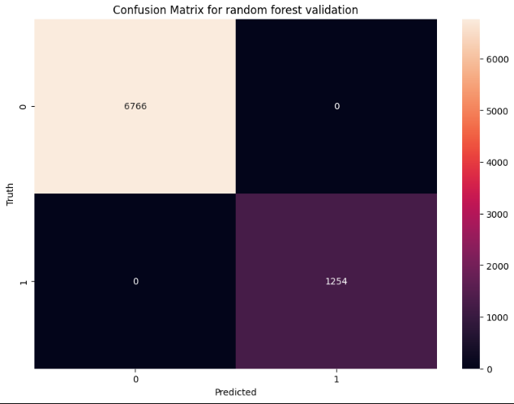

# A Machine Learning Project for Credit Predictions

## Introduction
This project uses a dataset of 50,000 rows containing client dummy data to predict whether an individual will receive credit based on certain features. It implements machine learning models, including Logistic Regression, K-Nearest Neighbors (KNN), and Random Forest, for prediction.

## Relevant Features from the Dataset
- **Month**: Refers to the month when the credit request was made.
- **Age**: The age of the client requesting the credit.
- **Annual Income**: The yearly income of the client.
- **Number of Bank Accounts**: The total number of bank accounts owned by the client.
- **Number of Credit Cards**: The total number of active credit cards the client possesses.
- **Interest Rate**: The interest rate applied to the requested credit.
- **Number of Loans**: The number of loans the client currently has before making the credit request.
- **Delays from Due Date**: The amount of time (in days) it took the client to pay a debt after its due date.
- **Number of Delayed Payments**: The total number of payments made after their due dates.
- **Credit Mix**: A numerical score reflecting the diversity of the client’s credit portfolio.
- **Credit History Age**: The duration (in years) of the client’s active credit history.
- **Monthly Balance**: The client’s average monthly balance, which is closely tied to their Annual Income.
---
## Data Exploration
As always, we need to first understand our objectives and our data. This not only involves technical knowledge but also business knowledge. The dataset originally was composed by the following features:
#### Categorical features
* <span style="color:red">ID</span>
* <span style="color:red">Customer_ID</span>
* Month (Can be converted to number or kept like this)
* <span style="color:red">Name</span>
* <span style="color:red">SSN</span>
* Occupation
* Type of Loan
* Credit mix
* Payment behaviour
* Payment_of_min_amount


### Discrete features
* Age
* Num_Bank_Accounts
* Interest Rate (Interest rate of loan)
* Num of Loan
* Delay_from_due_date
* Num_of_delayed_payment
* Num_Credit_Card
	
### Continous features
* Annual_Income
* Monthly_Inhand Salary
* Monthly_Balance
* Credit history age

This dataset originally lacked target labels, which meant we had to establish our own rules to determine who would qualify for credit. The following criteria was considered:
Regular Income: Ensuring consistent earnings.
* Enough payment capacity.
* Adequate Payment Capacity: Ability to meet financial obligations.
* Debt Capacity: Calculated as (Monthly Income - Fixed Expenses) × 0.40.
* Number of Bank Accounts: Having more than 3 accounts will be considered a risk factor.
* Avoidance of Discrimination: Occupation will not be considered a risk factor; the focus will be on other attributes.
* Annual Income vs. Monthly Salary: Annual income divided by 12 will be used instead of monthly in-hand salary, primarily due to missing values in the monthly salary data. It's important to note that annual income does not provide the same detailed information as monthly in-hand salary.
* Name: Names of individuals will not be relevant in the model; other attributes are sufficient to determine credit eligibility.
* Interest Rate: Although relevant, this does not directly determine credit approval.
* Month: The month of the credit request will be factored in.
* Missing Data that could have been useful:
Amount of loan it was asked: This would have been highly relevant.

--- 
## Data Preprocessing
We first identify our data and consider our business rules (relevant data to determine if someone receives a credit). By default name, SSN, Customer ID, ID  features are discarded as IDs commonly contribute no relevant information.
The data in this dataset has a signifcant number of inconsistencies. Typos, missing data all need to be handled with proper methods of mainly imputation and string manipulation to handle values which offer nothing to the analysis.
### Handling missing data, outliers and data insconsistencies.
Tasks Done:
* Replacing 'NA' text values with NaN so they can be worked with appropiately.
* Mode imputation on categorical features.
* Regular expressions to handle typos on 'Age','Annual Income' feature. 
* Monthly Inhand Salary and Annual Income have strong relationships, Monthly Inhand Salary has a lot of missing data so we took Annual Income and dropped Monthly Inhand Salary feature.
* Converting Amount of Loans to numeric type
* Replace Negative values in Number of Loans with NaN.
* Remove non numeric characters in 'Delay from due Date' feature.
* Convert 'Age' to numeric type.
* Replaced underscores in Credit Mix with NaN.
* Remove non numeric characters from 'Monthly Balance'.
* Mode imputation per Customer for all missing data (sometimes data already in possesion was missing on other requests).
* Removed 'Annual Income' outliers using IQR.
* Removed 'Number of Bank Accounts' outliers using IQR.
* Removed 'Number of Credit cards outliers' using IQR.
* Removed 'Interest Rate' outliers using IQR.
* Replace negative values on Number of Loans with NaN.
* Removed Number of Loans outliers with IQR.
* Credit History Age median imputation.
* Removed outliers from Monthly Balance.
---
Data Relationship Visualization:
Correlation Matrix on numeric data to find linear trends in data:


Chi-Square Test on categorical data.
After running this command Streamlit visual interface will open on browser and you can start making predictions. 


We use a p value of 0.05 as threshold, we will remove the following columns for our machine learning algorithms to reduce complexity:
* Type of Loan
* Payment of Min Amount
* Payment Behaviour
---
## Feature Engineering
### Encoding
* To keep consistency, we need to encode categorical data into numerical. Because months do have some order weight in how one comes and specific month, we Will use OrdinalEncoder for them.
* Because 'Bad', 'Standard', and 'Good' are relevant in the given order we Will also use OrdinalEncoder.
* After the previous preprocessing, training still keeps a really low amount of NaN values. As such, we chose te drop them as the amount of them is incredibly low.
* The data has vastly different scales and units. As such, we need to apply an scaler to the data. We chose to use Standard Scaler.
---
## Model Training
This is a classification model, as such we will use appropiate models compatible with the data:
### Logistic Regression
**Hyperparameters**: 100 maximum iterations.
**Logistic Regression Performance**


Cross Validation Score  
  

Confusion Matrix  
  

### K-Neighbors  
**Hyperparameters**: n_neighbors = 3  
**K-NN Performance**  
  

Cross Validation Score  
  

Confusion Matrix  
 

### Random Forest  
**Hyperparameters**: n_estimators = 100  
**K-NN Performance**  
  

Cross Validation Score  
  

Confusion Matrix  
 
---
Why metrics are so high on Random Forest?
**Simplicity of Target Rules**: Since the target is calculated using straightforward comparisons and basic math, Decision Trees, which excel at rule-based decision-making, may already be more than sufficient. Random Forest, being an ensemble of multiple Decision Trees, adds unnecessary complexity for such a simple task, potentially leading to inflated metrics.

What improvements can be done?
*Include pipelines for scalers and model building. 
*Apply regularization to reduce overfitting. 
* Include decision trees and see the results, compare them with random forest. 
* Include GridSearch or RandomSearch to test hyperparameters 
## Installation
You can run this machine learning models in two ways, via cloud or locally in your environment.

## Cloud Deployment
If you want to use the interactive web app you can go directly to the web application [Credit Application](https://maujs-ml.streamlit.app/) .
If you want to instead run this project locally, follow the steps below:

## Local Installation instructions
To run the Project locally, follow the steps below:
1. Clone the repository:
   ```bash
   git clone https://github.com/mau-JS/OracleML.git
   cd OracleML
   ```
2. Installing required dependencies:
  ```bash
   pip install -r requirements.txt
  ```
3. Running Streamlit application, open console and go again to OracleML folder:
   ```bash
   streamlit run app.py
   ```


